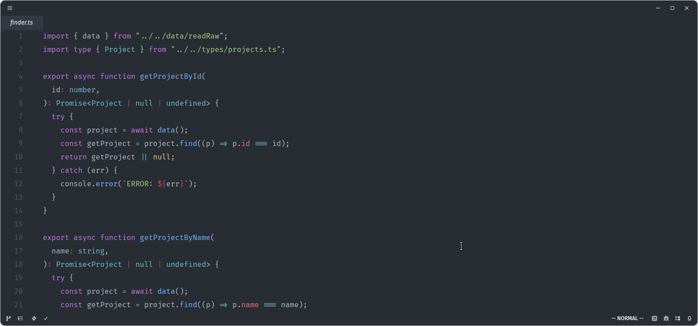
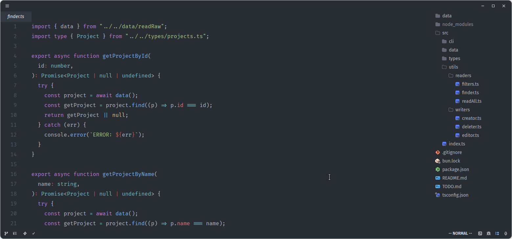
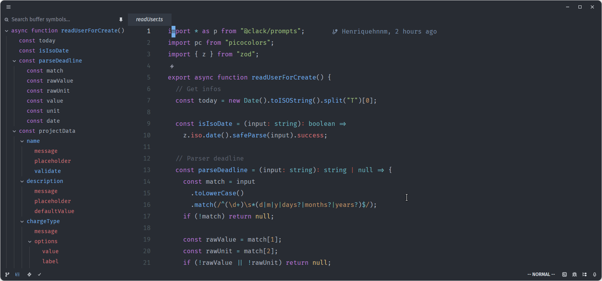
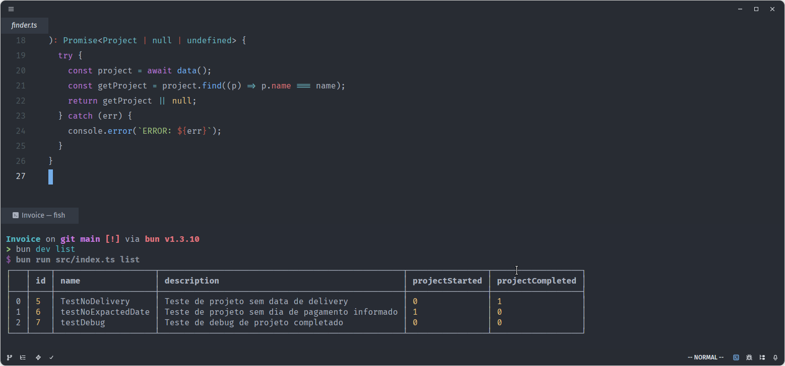

# Zed Minimal Config

> Configuração ultra minimalista do Zed para quem quer ZERO distração

## Features
- 🎯 Helix mode
- 🐚 Fish shell integrado
- 🎨 One Dark customizado
- 🚫 AI desabilitado
- 📏 Zero scrollbars, zero indent guides
- ⌨️ FiraCode Nerd Font

## Instalação
- Clone o repo ou baixe o arquivo `settings.json`
- Instale os Charmed Icon Themes
- Substitua seu arquivo de configuracoes do zed

## Screenshot

### Code

### Project Bar

### Left Dock

### Terminal

